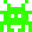

# Space Shooter 

A small arcade-style game, inspired by 
[Space Invaders](https://en.wikipedia.org/wiki/Space_Invaders) 
and [Galaga](https://en.wikipedia.org/wiki/Galaga),
made for the purpose of teaching git version control
to beginner programmers.
Therefor the game is deliberately implemented 
with as few Python/programming concepts as possible
and without using pygame's built-in functionality for
detecting collisions, creating game objects etc.
The tutorial using this game is focused on version control,
not Python or pygame programming. 

Documentation for the pygame library can be found at https://www.pygame.org/docs/ . 

The section [Modifying / extending the game](modifying-extending-the-game)
is meant as a help to those without prior experience with the pygame library.
Consult it if you want to extend or modify the game.


## Installation / usage
1. Clone the repository
2. Install pygame `pip install pygame`
3. Run game.py


## Modifying / extending the game 
Select notes on how the game is made and how to modify it or extend it.

### Coordinate system
The coordinate system in pygame has the positive y-axis pointing downwards:

```
  (0,0)__________________(400,0)
       |                 |
       | (400px x 600px) |
       |   game window   |
       |                 |
       |                 |
       |                 |
       |                 |
(0,600)|_________________|(400,600)
```
Increasing the x-coordinate of an object moves it to the right, 
increasing the y-coordinate of an object moves it down.

### Rectangles
Rectangles in pygame are represented by four values `(x, y, w, h)`
where (`x`, `y`) are the coordinates of the top-left corner, 
`w` the width and `h` the height of the rectangle.

An image drawn on the screen at position (0,0) will appear
flush with the left and top side of the game window:

``` python
screen.blit(image, (0, 0))
```

As will a grey, 100 x 200 px rectangle drawn by at position (0,0):

``` python
pg.draw.rect(screen, (200, 200, 200), (0, 0, 100, 200))
```

### Dictionaries
The enemy aliens and the projectiles fired by the spaceship are stored 
in dictionaries.

If you have no previous experience with dictionaries think of them 
as lists where elements have names instead of numeric indices.


Alien at location (x,y)=(100,200) represented by a dictionary:

``` python
alien = {'x': 100, 'y': 200}
alien['y'] += 2 # Move the alien 2 px in the y-direction
```

Additional alien attributes such as hit points or individual speed
should be added as items (key:value pairs) to the dictionaries:

``` python
alien = {'x':100, 'y': 200, 'hp': 10, 'speed': 2}
alien['y'] += alien['speed']
```

### Animations using modulo
Animations are made by displaying different images in different frames.
The images are stored in lists, so cycling through images 
requires cycling through list indices: 
`images[0]`, `images[1]`, `images[2]`, `images[3]`, `images[0]`, ...

The repeating sequence of indices 0, 1, 2, 3, 0, 1 ... is produced by 
the modulo operator `%`:

``` python
tick = 0
while tick < 100:
    r = tick % 4
    print(tick, r)
    tick += 1
```

The modulo operator `%` performs integer division and returns the remainder:
* 0 % 4 = 0 because 0 divided by 4 is 0 with a remainder of 0 (0 = 0*4 + 0) 
* 1 % 4 = 1 because 1 divided by 4 is 0 with a remainder of 1 (1 = 0*4 + 1)
* 2 % 4 = 2 because 2 divided by 4 is 0 with a remainder of 2 (2 = 0*4 + 2)
* 4 % 4 = 0 because 4 divided by 4 is 1 with a remainder of 0 (4 = 1*4 + 0)
* 5 % 4 = 1 because 5 divided by 4 is 1 with a remainder of 1 (5 = 1*4 + 1)

`tick % 4` gives the fastest possible animation speed, 
the sequence 0, 1, 2, 3, 0, 1 changes the image every frame.

`int(tick/2) % 4` gives 50% animation speed by producing the sequence 
0, 0, 1, 1, 2, 2, 3, 3, 0, 0, 
causing each image to  to be displayed in two consecutive frames.

## Collision detection
Detecting collision of aliens and projectiles is done by manually testing 
if the projectile's rectangle overlaps the alien's rectangle.

```
(x1,y1) ___________________
       |                   |
       |   R1              |
       |                   | h1
       |      (x2,y2)______|________
       |            |      |        |
       |____________|______|        |
              w1    |               | h2
                    |          R2   |
                    |_______________|
                           w2
```

For two rectangles R1=(x1, y1, w1, h1) and R2=(x2, y2, w2, h2)
to overlap horizontally the following two statements have to be true:

* The left side of R2 has to be to the left of the right side of R1
  (`x2 < x1+w1`).

* The right side of R2 has to be to the right of the left side of R2
  (`x2+w2 > x1`)

The same applies in the vertical direction.